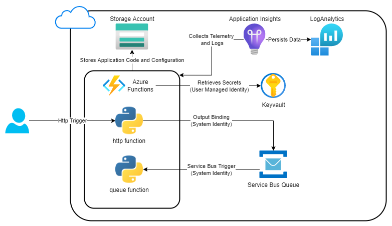
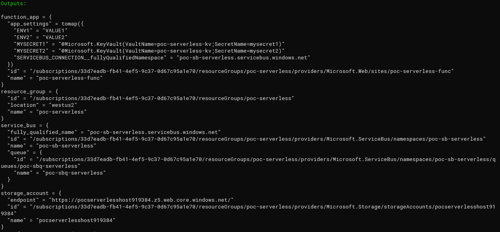
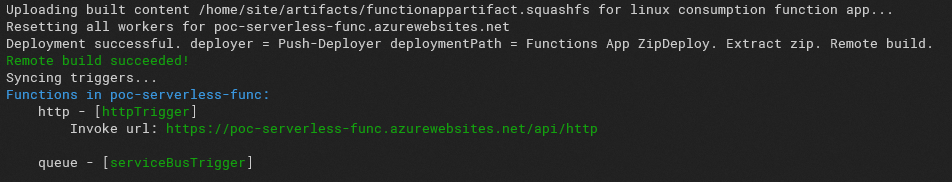
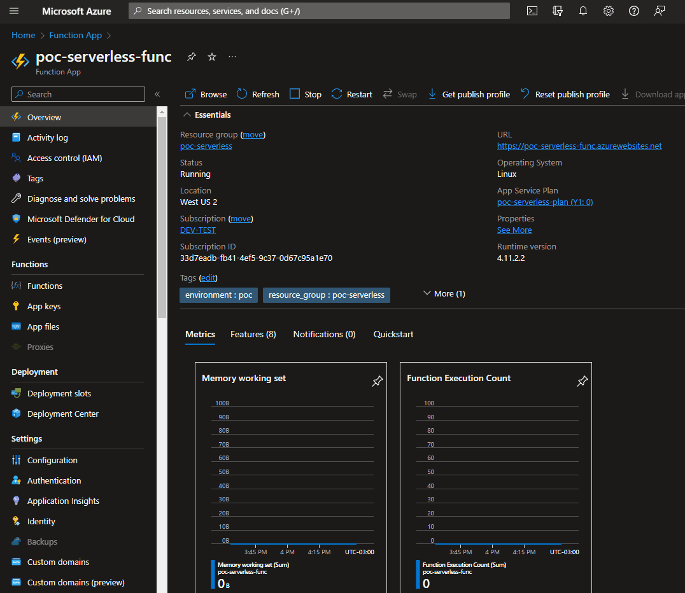

# Azure Functions Studies

This project intends to setup an Azure Functions Application. Using terraform in order to provision the underlying infrastruture and application configuration. And Python to write the application logic.



## Setup
---

- [Create an Azure Account](https://azure.microsoft.com/en-us/free/)
- [Install Terraform](https://learn.hashicorp.com/tutorials/terraform/install-cli)
- [Install TF_ENV](https://github.com/tfutils/tfenv)
- [Install Azure Functions Core Tools](https://learn.microsoft.com/en-us/azure/azure-functions/functions-run-local?tabs=v4%2Clinux%2Ccsharp%2Cportal%2Cbash)
- [Install Python 3.7](https://www.linuxcapable.com/how-to-install-python-3-7-on-ubuntu-20-04-lts/)

## Provisioning Infrastructure
---

This environment is totally build using [Terraform](https://www.terraform.io/)

```bash
# from repository root folder
cd infrastructure
az login
tfenv install
tfenv use
terraform init
terraform apply
```

### `Outputs:`



## Deploying Application
---

The application is deployed using [Azure Functions Core Tools](https://learn.microsoft.com/en-us/azure/azure-functions/functions-run-local?tabs=v4%2Clinux%2Ccsharp%2Cportal%2Cbash) through the following command:

```bash
# func azure functionapp publish <azure-function-app-name>

# from repository root folder
cd serverless
az login
func azure functionapp publish poc-serverless-func
```

### `Outputs:`


## Testing Application
---

The application could be testing sending the following json to the http endpoint
```json
{
    "message": "az-function-rocks", # General Message (Any String)
    "date": "2022-09-22T09:30:26",  # Date using ISO8601
    "error": false                  # Boolean indicating if an error should be raised ( for testing exceptions )
}
```

After the http invokation, the http function will post the message in the service bus queue and the queue function will be trigged to consume the message

### `Results:`




## Telemetry & Logs
---

All azure function application's telemetry and logs are capture by [Application Insights](https://learn.microsoft.com/en-us/azure/azure-monitor/app/app-insights-overview?tabs=net) and configured using the [host.json file](./serverless/host.json). By default Application Insights capture everything, including azure infrastructure logs, warm-up phases etc. And it could result in a huge bill in intensive workloads. So, an optimize configuration was done to just capture by default Error Logs and meaningful information like success/error ratio user application logs etc.


```json
{
    "logging": {
      "fileLoggingMode": "debugOnly",
      "logLevel": {
          "default": "Error",                  # By Default just capture Error Logs 
          "Host.Results": "Information",       # Captures Success/Error Ratio
          "Host.Aggregator": "Information",    # Captures Performance Metrics ( Invocation Time etc )
          "Function.http.User": "Debug",       # Captures User Application Logs from http application
          "Function.queue.User": "Debug"       # Captures User Application Logs from queue application
      },
      "applicationInsights": {                 
        "samplingSettings": {
          "isEnabled": true,                   # Configure Statistical Sampling under High throughput
          "excludedTypes": "Request;Exception" # excluding Request and Exception Logs
        },
        "enableLiveMetrics": false,                    # Disables Live Metrics
        "enableDependencyTracking": false,             # Disables Dependency Tracking Information
        "enablePerformanceCountersCollection": false   # Disables Hardware Performance Counters Information
      }
  }
}
```

Although if a new function is created it is necessary to include an exception in this file, in order to collect the "debug" severite log, otherwise the log will not show up in the LogAnalytics

```json
{
    "logging": {
      "fileLoggingMode": "debugOnly",
      "logLevel": {
          "default": "Error",                  
          "Host.Results": "Information",       
          "Host.Aggregator": "Information",    
          "Function.http.User": "Debug",       
          "Function.queue.User": "Debug",
          "Function.<new-function-name>.User": "Debug" # When a new function is create is necessary to include this 
                                                       # configuration replacing the "<new-function-name>" with the
                                                       # real function name      
      }
    }
  }
```

## Local Development
---

Using the [Azure Functions Core Tools](https://learn.microsoft.com/en-us/azure/azure-functions/functions-run-local?tabs=v4%2Clinux%2Ccsharp%2Cportal%2Cbash) it is possible to execute the function locally. However, keep in mind that your user should have the `required permissions` to perform the actions that azure functions executes on cloud like: `    "Azure Service Bus Data Sender"`, `"Azure Service Bus Data Receiver"` and `"Key Vault Secrets User"`.

Also, it is necessary to sync the azure function application settings ("environment variables") using the following command

```bash
# func azure functionapp fetch-app-settings <function-app-name>

# from repository root folder
cd serverless
az login
func azure functionapp fetch-app-settings poc-serverless-func
func settings decrypt
```

This command download the function application settings and saves it in the `local.settings.json` (never ever commits this file since it contains your secrets)

```json
# local.settings.json file
{
  "IsEncrypted": false,
  "Values": {
    "FUNCTIONS_WORKER_RUNTIME": "python",
    "AzureWebJobsStorage": "DefaultEndpointsProtocol=https;AccountName=pocserverlesshost410214;AccountKey=FEvhg4JT*******qAtLg==;EndpointSuffix=core.windows.net",
    "FUNCTIONS_EXTENSION_VERSION": "~4",
    "APPINSIGHTS_INSTRUMENTATIONKEY": "78e9b5fe-67cf-41dc-8add-50cc9c5cd0bf",
    "ENV2": "VALUE2",
    "ENV1": "VALUE1",
    "AzureWebJobsDashboard": "DefaultEndpointsProtocol=https;AccountName=pocserverlesshost410214;AccountKey=FEvhg4JTjjAPgmRkrNK0tjNQJR4rB1jBCUwx4na2c7eAiqeFOaTpQVzN34VRyiwtq13a+JyrCgHd+ASt8qAtLg==;EndpointSuffix=core.windows.net",
    "MYSECRET2": "@Microsoft.KeyVault(VaultName=poc-serverless-kv;SecretName=mysecret2)",
    "MYSECRET1": "@Microsoft.KeyVault(VaultName=poc-serverless-kv;SecretName=mysecret1)",
    "SERVICEBUS_CONNECTION__fullyQualifiedNamespace": "poc-sb-serverless.servicebus.windows.net"
  },
  "ConnectionStrings": {}
}
```

Since system-managed identity was utilized it is necessary to create a new variable for each entry that has the suffix `"__fullyQualifiedNamespace"` without the suffix and with an empty value. This example has the entry `SERVICEBUS_CONNECTION__fullyQualifiedNamespace`, so a new entry `SERVICEBUS_CONNECTION` should be created with an empty value.

```json
{
  "IsEncrypted": false,
  "Values": {
    "FUNCTIONS_WORKER_RUNTIME": "python",
    "AzureWebJobsStorage": "DefaultEndpointsProtocol=https;AccountName=pocserverlesshost410214;AccountKey=FEvhg4JT*******qAtLg==;EndpointSuffix=core.windows.net",
    "FUNCTIONS_EXTENSION_VERSION": "~4",
    "APPINSIGHTS_INSTRUMENTATIONKEY": "78e9b5fe-67cf-41dc-8add-50cc9c5cd0bf",
    "ENV2": "VALUE2",
    "ENV1": "VALUE1",
    "AzureWebJobsDashboard": "DefaultEndpointsProtocol=https;AccountName=pocserverlesshost410214;AccountKey=FEvhg4JTjjAPgmRkrNK0tjNQJR4rB1jBCUwx4na2c7eAiqeFOaTpQVzN34VRyiwtq13a+JyrCgHd+ASt8qAtLg==;EndpointSuffix=core.windows.net",
    "MYSECRET2": "@Microsoft.KeyVault(VaultName=poc-serverless-kv;SecretName=mysecret2)",
    "MYSECRET1": "@Microsoft.KeyVault(VaultName=poc-serverless-kv;SecretName=mysecret1)",
    "SERVICEBUS_CONNECTION__fullyQualifiedNamespace": "poc-sb-serverless.servicebus.windows.net",
    "SERVICEBUS_CONNECTION": "" # New Variable Created
  },
  "ConnectionStrings": {}
}
```

After that, just execute this command to start your functions locally

```bash
# from repository root folder
cd serverless
python -m venv .venv
source .venv/bin/activate
func start
```
### `Results:`


## References
---

- [`Quickstart Azure Functions Python`](https://learn.microsoft.com/en-us/azure/azure-functions/create-first-function-cli-python?tabs=azure-cli%2Cbash%2Cbrowser)

- [`Azure Functions Python Developer Guide`](https://learn.microsoft.com/en-us/azure/azure-functions/create-first-function-cli-python?tabs=azure-cli%2Cbash%2Cbrowser)

- [`Azure Functions Python SDK Reference`](https://learn.microsoft.com/en-us/python/api/azure-functions/azure.functions?view=azure-python)

- [`Working with Azure Functions Core Tools`](https://learn.microsoft.com/en-us/azure/azure-functions/create-first-function-cli-python?tabs=azure-cli%2Cbash%2Cbrowser)

- [`Azure Functions Triggers and Bindings`](https://learn.microsoft.com/en-us/azure/azure-functions/functions-triggers-bindings?tabs=python)

- [`Azure Functions Bindings Expressions Patterns`](https://learn.microsoft.com/en-us/azure/azure-functions/functions-bindings-expressions-patterns)

- [`Azure Functions Identity Based Connection`](https://learn.microsoft.com/en-us/azure/azure-functions/functions-reference?tabs=blob#common-properties-for-identity-based-connections)

- [`Azure Functions Host Storage Identity Based Connections`](https://learn.microsoft.com/en-us/azure/azure-functions/functions-reference?tabs=blob#connecting-to-host-storage-with-an-identity-preview)

- [`Azure Functions Keyvault References`](https://learn.microsoft.com/en-us/azure/app-service/app-service-key-vault-references?tabs=azure-cli#access-vaults-with-a-user-assigned-identity)

- [`Azure Functions Configure Telemetry`](https://docs.microsoft.com/en-us/azure/azure-functions/configure-monitoring?tabs=v2)

- [`Azure Functions Configure Functions - host.json Reference`](https://docs.microsoft.com/en-us/azure/azure-functions/functions-host-json)

- [`External Deploy - Run from Package`](https://learn.microsoft.com/en-us/azure/azure-functions/run-functions-from-deployment-package) 

- [`App Settings Reference`](https://learn.microsoft.com/en-us/azure/azure-functions/functions-app-settings)